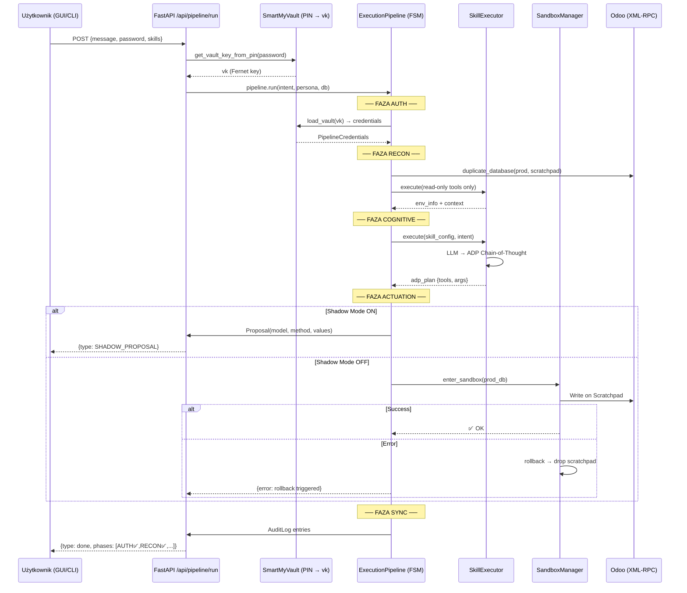

# 🏗️ Sprint SPRINT-F7-01 — Pipeline Integration (Faza 7.1)

> **Architekt:** /arch | **Tryb:** Sequential
> **Data:** 2026-06-08 | **Bazuje na:** SPIKE Roadmap Status + Sprint F5-02 (ADP & FSM)
> **Parent Phase:** Faza 7 — Production Hardening & Client-Server Mode

---

## 📋 Sekcja A — Business Discovery & Rules

### Cel biznesowy
Orkiestrator (`SkillExecutor` + `/api/chat`) obsługuje obecnie wyłącznie **luźne konwersacje** — model LLM odpowiada na pytania i wywołuje narzędzia, ale bez żadnego nadzoru transakcyjnego. Operacje modyfikujące dane Odoo (CREATE/UPDATE/DELETE) nie przechodzą przez przewidywalny, audytowalny potok bezpieczeństwa.

**Problem:** Agent może wykonywać operacje `write` bez wcześniejszej autoryzacji Vault, bez analizy ADP, bez rollbacku i bez Shadow Mode — łamiąc zasady ADR-001 (Zero-Trust) i ADR-005 (Shadow Mode via Form Banner).

**Rozwiązanie:** Spięcie `SkillExecutor` z istniejącą Maszyną Stanów `ExecutionPipeline` (pipeline.py, Sprint F5-02) tak, aby każda operacja agenta mogła opcjonalnie przejść pełen cykl FSM: **AUTH → RECON → COGNITIVE → ACTUATION → SYNC**.

### User Stories

| # | Story | Persona |
|---|-------|---------|
| US-1 | JAKO Administrator CHCĘ, aby agent automatycznie pobierał credentials z SmartMyVault na początku potoku FSM ŻEBY nie było potrzeby ręcznego ustawiania ENV. | Admin |
| US-2 | JAKO Agent CHCĘ, aby moje narzędzia read-only były zablokowane przed zapisem w fazie RECON ŻEBY nie psuć danych przed analizą. | Agent |
| US-3 | JAKO Użytkownik CHCĘ widzieć, w jakiej fazie FSM aktualnie działa agent (AUTH/RECON/COGNITIVE/ACTUATION/SYNC) ŻEBY mieć poczucie kontroli i transparentności. | User |
| US-4 | JAKO System CHCĘ, aby każdy błąd w fazie ACTUATION automatycznie wyzwalał `rollback()` i usuwał Scratchpad DB ŻEBY nie zostawiać brudnych stanów na Odoo. | System |

### Metryka sukcesu (DoD)
```
python -m pytest tests/swarm/test_pipeline.py tests/swarm/test_executor.py -v → ALL GREEN
+ nowe testy integracyjne pipeline↔executor → GREEN
```

### ⚖️ ZASADY SPRINTU

#### Zasada 1: SEQUENTIAL GATE 🔴
Sprint podzielony na 4 fazy sekwencyjne. Faza N+1 nie startuje dopóki BRAMKA Fazy N nie jest zielona.

#### Zasada 2: TDD FIRST 🟠
Każda faza zaczyna się od napisania testów (RED), implementacji (GREEN), refaktoru.

#### Zasada 3: SCOPE ISOLATION 🔴
- **Faza 1:** `smartmyodoo/swarm/pipeline.py` (+ nowy `vault_auth.py`)
- **Faza 2:** `smartmyodoo/swarm/pipeline.py` ← `executor.py` integration
- **Faza 3:** `smartmyodoo/api.py` ← endpoint routing + WebSocket FSM events
- **Faza 4:** `tests/swarm/test_pipeline_integration.py` (nowy)

---

## 🧱 Sekcja B — Podział Zadań

### Graf zależności między Fazami

```
┌──────────────────────────────────────────────────────┐
│  FAZA 1: Vault Auth Wrapper (AUTH phase)             │
│  [B1.1] VaultAuthProvider — adapter pobierający      │
│         credentials ze SmartMyVault via PIN           │
│  [B1.2] Integracja z _execute_auth() w pipeline.py   │
│  [B1.3] Testy jednostkowe (mock Vault)               │
└──────────────────┬───────────────────────────────────┘
                   │ ✅ BRAMKA: pytest tests/swarm/test_vault_auth.py → GREEN
                   ▼
┌──────────────────────────────────────────────────────┐
│  FAZA 2: SkillExecutor ↔ Pipeline Integration        │
│  [B2.1] Restrykcje narzędzi per-faza (read-only      │
│         w RECON, write w ACTUATION)                   │
│  [B2.2] Podłączenie SkillExecutor jako COGNITIVE     │
│  [B2.3] SandboxManager auto-enter w ACTUATION        │
│  [B2.4] Testy FSM flow z SkillExecutor               │
└──────────────────┬───────────────────────────────────┘
                   │ ✅ BRAMKA: pytest tests/swarm/test_pipeline.py → GREEN (rozszerzone)
                   ▼
┌──────────────────────────────────────────────────────┐
│  FAZA 3: API Routing — Pipeline Mode Endpoint        │
│  [B3.1] Nowy endpoint POST /api/pipeline/run         │
│  [B3.2] WebSocket FSM state events (phase reporting) │
│  [B3.3] Audit Trail per-faza (ADR-011)               │
│  [B3.4] Token Governor check (ADR-012)               │
└──────────────────┬───────────────────────────────────┘
                   │ ✅ BRAMKA: pytest tests/test_api.py -k pipeline → GREEN
                   ▼
┌──────────────────────────────────────────────────────┐
│  FAZA 4: Integration Tests & Rollback Hardening      │
│  [B4.1] Happy path E2E (AUTH→SYNC, mocked LLM)      │
│  [B4.2] Rollback scenario (error in ACTUATION)       │
│  [B4.3] Shadow Mode scenario (requires_human_override)│
│  [B4.4] Missing Vault key scenario (AUTH failure)     │
└──────────────────────────────────────────────────────┘
```

---

### Sekcja B1 — FAZA 1: Vault Auth Wrapper

> **Trigger:** `/dev` po zatwierdzeniu planu
> **📁 Scope:** `smartmyodoo/swarm/vault_auth.py` [NEW], `smartmyodoo/swarm/pipeline.py`, `tests/swarm/test_vault_auth.py` [NEW]

| # | Zadanie | DoD | Status |
|---|---------|-----|--------|
| 1.1 | **[NEW] `VaultAuthProvider`** — klasa adapter wstrzykująca credentials z `SmartMyVault` do kontekstu pipeline'u. Używa `vault.get_vault_key_from_pin()` do pobrania `vk`, następnie `vault.load_vault(vk)` do wyciągnięcia sekretów Odoo (`ODOO_URL`, `ODOO_DB`, `ODOO_LOGIN`, `ODOO_PASSWORD`) oraz klucza LLM (`OPENROUTER_KEY`). | Klasa istnieje, zwraca `PipelineCredentials` dataclass | [ ] |
| 1.2 | **Dataclass `PipelineCredentials`** — kontener na odkodowane sekrety (odoo_url, odoo_db, odoo_login, odoo_password, openrouter_key). Żadne pole nie może być `None` po pomyślnej autoryzacji. | Type-safe, frozen dataclass | [ ] |
| 1.3 | **Modyfikacja `_execute_auth()`** w `pipeline.py` — zamiast stub `logger.info("AUTH: Walidacja dostępów")` wstrzyknąć wywołanie `VaultAuthProvider.authenticate(pin)`. Rzuca `PipelineError("AUTH failed")` jeśli Vault nie odpowie. | `pipeline.py` używa providera | [ ] |
| 1.4 | **Obsługa `VaultDecryptionError`** — zgodnie z ADR-001 i KI SmartMyVault, łapanie wyjątku w AUTH i konwertowanie go na `PipelineError` z sanitized message (ADR-011: bez PII/kluczy w logach). | Wyjątek złapany, log czysty | [ ] |
| 1.5 | **Testy jednostkowe** (`tests/swarm/test_vault_auth.py`): (a) happy path z mockiem vault, (b) invalid PIN → PipelineError, (c) brak vault_data.enc → PipelineError. | 3 testy GREEN | [ ] |
| 1.6 | **BRAMKA:** `python -m pytest tests/swarm/test_vault_auth.py -v` | ✅ ALL GREEN | [ ] |

---

### Sekcja B2 — FAZA 2: SkillExecutor ↔ Pipeline Integration

> **Trigger:** Bramka Fazy 1 GREEN
> **📁 Scope:** `smartmyodoo/swarm/pipeline.py`, `smartmyodoo/swarm/executor.py`, `tests/swarm/test_pipeline.py`

| # | Zadanie | DoD | Status |
|---|---------|-----|--------|
| 2.1 | **Tool Restriction per Phase** — nowy mechanizm w `pipeline.py` filtrujący `allowed_tools` w zależności od bieżącej fazy FSM: RECON=read-only (`odoo_search`, `odoo_schema`, `search_knowledge_base`, `read_odoo_log`, `search_odoo_code`), ACTUATION=full access, inne fazy=brak. | Lista narzędzi per-state działa | [ ] |
| 2.2 | **Podłączenie `SkillExecutor` w `_execute_cognitive()`** — zamiast obecnego inline `config = SkillConfig(...)`, użyć pełnej integracji: executor dostaje credentials z fazy AUTH, env_info z fazy RECON, a ADP plan jest wykonywany jako `executor.execute(config, intent)`. | Faza COGNITIVE używa executor | [ ] |
| 2.3 | **Podłączenie `SandboxManager` w `_execute_actuation()`** — automatyczne `enter_sandbox()` jeśli plan z COGNITIVE zawiera jakiekolwiek write tools. Jeśli skill ma `requires_shadow_mode=True` → nie aplikuj na prod, tylko zaloguj propozycję. | Sandbox aktywowany automatycznie | [ ] |
| 2.4 | **Rozszerzenie `rollback()`** — dodanie logowania do `AuditLog` (tabela w SQLite) informacji o rollbacku: timestamp, faza w której nastąpił błąd, komunikat. | Rollback audytowalny | [ ] |
| 2.5 | **Testy FSM flow** (rozszerzenie `test_pipeline.py`): (a) happy path z mockiem SkillExecutor, (b) tool restriction enforcement (write tool w RECON → blocked), (c) Shadow Mode → propozycja zamiast write. | 3+ nowe testy GREEN | [ ] |
| 2.6 | **BRAMKA:** `python -m pytest tests/swarm/test_pipeline.py -v` | ✅ ALL GREEN (stare + nowe) | [ ] |

---

### Sekcja B3 — FAZA 3: API Routing — Pipeline Mode

> **Trigger:** Bramka Fazy 2 GREEN
> **📁 Scope:** `smartmyodoo/api.py`, `smartmyodoo/ui/js/components/chat.js`

| # | Zadanie | DoD | Status |
|---|---------|-----|--------|
| 3.1 | **Nowy endpoint `POST /api/pipeline/run`** — przyjmuje `{message, workspace_id, session_id, password, selected_skills, use_pipeline: true}`. Inicjalizuje `ExecutionPipeline` z `VaultAuthProvider`, `SkillExecutor`, `SandboxManager` i uruchamia `pipeline.run()`. | Endpoint istnieje i działa | [ ] |
| 3.2 | **WebSocket FSM Events** — rozszerzenie `/api/chat/stream` o opcjonalne zdarzenia `{"type": "fsm_state", "phase": "AUTH"}` emitowane przy każdym `_transition_to()`. Klient GUI może wyświetlić stepper (AUTH ✅ → RECON ⏳ → ...). | Eventy lecą po WS | [ ] |
| 3.3 | **Audit Trail per-faza** — każda tranzycja stanu FSM logowana do `AuditLog` w SQLite (ADR-011). Format: `action="fsm_transition", details="AUTH→RECON, workspace=X"`. | Wpisy w tabeli audit_log | [ ] |
| 3.4 | **Token Governor Guard** — przed fazą COGNITIVE sprawdzić TokenGovernor (ADR-012): estymacja promptu ≤ limitu modelu. Jeśli przekracza → PipelineError("Context exceeds model limit"). | Guardrail aktywny | [ ] |
| 3.5 | **BRAMKA:** `python -m pytest tests/test_api.py -k pipeline -v` | ✅ GREEN | [ ] |

---

### Sekcja B4 — FAZA 4: Integration Tests & Rollback Hardening

> **Trigger:** Bramka Fazy 3 GREEN
> **📁 Scope:** `tests/swarm/test_pipeline_integration.py` [NEW]

| # | Zadanie | DoD | Status |
|---|---------|-----|--------|
| 4.1 | **Test: Happy Path E2E** — mock LLM, mock Vault, mock DB Manager. Pipeline przechodzi AUTH→RECON→COGNITIVE→ACTUATION→SYNC. Stan końcowy = SYNC, brak rollbacku. | 1 test GREEN | [ ] |
| 4.2 | **Test: Rollback on ACTUATION error** — mock `_execute_actuation()` rzuca Exception. Sprawdzenie: `rollback()` wywołany, Scratchpad DB usunięty, AuditLog zawiera wpis o rollbacku. | 1 test GREEN | [ ] |
| 4.3 | **Test: Shadow Mode** — skill z `requires_shadow_mode=True`. Weryfikacja: ACTUATION nie pisze do DB, tworzy `Proposal` w tabeli proposals, stan=pending. | 1 test GREEN | [ ] |
| 4.4 | **Test: AUTH failure (brak Vault)** — `VaultAuthProvider.authenticate()` rzuca `VaultDecryptionError`. Pipeline nie przechodzi dalej niż AUTH, log sanitized. | 1 test GREEN | [ ] |
| 4.5 | **Test: Tool Restriction** — w fazie RECON próba wywołania `odoo_create` → zablokowana. W fazie ACTUATION → dozwolona. | 1 test GREEN | [ ] |
| 4.6 | **BRAMKA FINALNA:** `python -m pytest tests/ -v` | ✅ ALL GREEN (57+ istniejące + nowe) | [ ] |

---

## 📊 Mapa Plików (Scope Summary)

| Plik | Akcja | Opis zmian |
|------|-------|------------|
| [vault_auth.py](file:///c:/od_zera_do_ai/SmartMyOdoo/smartmyodoo/swarm/vault_auth.py) | **[NEW]** | `VaultAuthProvider` + `PipelineCredentials` dataclass |
| [pipeline.py](file:///c:/od_zera_do_ai/SmartMyOdoo/smartmyodoo/swarm/pipeline.py) | **[MODIFY]** | Integracja z VaultAuth, SkillExecutor, tool restrictions, audit rollback |
| [executor.py](file:///c:/od_zera_do_ai/SmartMyOdoo/smartmyodoo/swarm/executor.py) | **[MODIFY]** | Opcjonalny parametr `phase_restrictions` do blokowania write tools |
| [api.py](file:///c:/od_zera_do_ai/SmartMyOdoo/smartmyodoo/api.py) | **[MODIFY]** | Nowy endpoint `/api/pipeline/run`, WS FSM events |
| [test_vault_auth.py](file:///c:/od_zera_do_ai/SmartMyOdoo/tests/swarm/test_vault_auth.py) | **[NEW]** | Testy VaultAuthProvider |
| [test_pipeline.py](file:///c:/od_zera_do_ai/SmartMyOdoo/tests/swarm/test_pipeline.py) | **[MODIFY]** | Rozszerzenie o testy integracji executor↔pipeline |
| [test_pipeline_integration.py](file:///c:/od_zera_do_ai/SmartMyOdoo/tests/swarm/test_pipeline_integration.py) | **[NEW]** | Testy E2E happy path, rollback, shadow mode, auth failure |

---

## 📐 Architektura — Diagram Przepływu



---

## ✅ Sekcja E — Finalna Weryfikacja

> Wykonuje `/qa` po zakończeniu wszystkich faz.

| # | Check | Komenda | Oczekiwany wynik |
|---|-------|---------|------------------|
| V1 | Unit Tests | `python -m pytest tests/swarm/test_vault_auth.py tests/swarm/test_pipeline.py -v` | ✅ ALL GREEN |
| V2 | Integration Tests | `python -m pytest tests/swarm/test_pipeline_integration.py -v` | ✅ ALL GREEN |
| V3 | API Tests | `python -m pytest tests/test_api.py -k pipeline -v` | ✅ ALL GREEN |
| V4 | Full Suite | `python -m pytest tests/ -v` | ✅ 57+ GREEN, 0 FAIL |
| V5 | Audit Trail | Po uruchomieniu pipeline: `SELECT * FROM audit_log WHERE action LIKE 'fsm%'` | ≥5 wpisów (AUTH→RECON→COGNITIVE→ACTUATION→SYNC) |
| V6 | Log Sanitization | Sprawdzić logi — brak PIN-u, haseł ani kluczy API w plain text | ✅ ADR-011 compliance |

---

## 📈 Sprint Metrics

| Metryka | Przed (Obecny Stan) | Cel |
|---------|------|-----|
| Pipeline FSM podłączony do `/api` | ❌ Rozłączony (stub) | ✅ Pełna integracja |
| Vault auto-inject w AUTH | ❌ `logger.info("AUTH: Walidacja dostępów")` | ✅ `VaultAuthProvider.authenticate()` |
| Tool restrictions per phase | ❌ Brak (wszystkie narzędzia dostępne zawsze) | ✅ RECON=read-only, ACTUATION=full |
| Rollback audytowalny | ❌ Tylko log + drop DB | ✅ AuditLog w SQLite |
| Shadow Mode w FSM | ❌ Nie zintegrowany | ✅ Shadow → Proposal w DB |
| FSM state reporting (WS) | ❌ Brak | ✅ `{"type":"fsm_state"}` events |
| Nowe testy | 0 | ≥8 nowych testów |

---

## 🏁 Definition of Done

- [ ] `VaultAuthProvider` pobiera credentials z Vault i wstrzykuje do pipeline
- [ ] `SkillExecutor` jest fazą COGNITIVE w `ExecutionPipeline`
- [ ] Narzędzia write-only zablokowane w fazie RECON
- [ ] Rollback logowany do AuditLog w SQLite
- [ ] Nowy endpoint `POST /api/pipeline/run` działa end-to-end
- [ ] WebSocket emituje `fsm_state` events przy przejściach
- [ ] Shadow Mode skills generują `Proposal` zamiast bezpośredniego write
- [ ] `python -m pytest tests/ -v` → ALL GREEN (57+ istniejące + ≥8 nowych)
- [ ] Brak wycieków sekretów w logach (ADR-011)
- [ ] Sprint zamknięty w YAML frontmatter (`status: DONE`)
