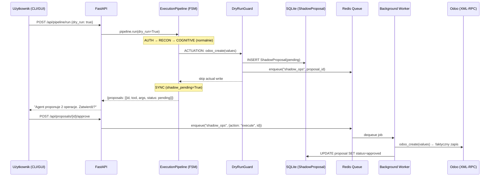
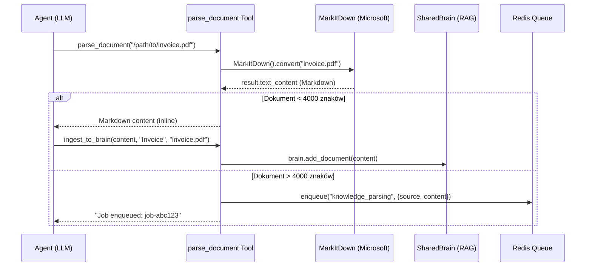
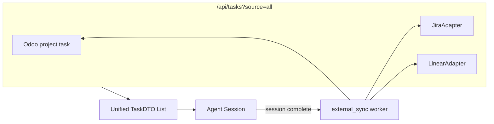

# 🏗️ Sprint SPRINT-F7-03 — Advanced Features & Extended Ecosystem (Faza 7.3)

> **Architekt:** /arch | **Tryb:** Sequential
> **Data:** 2026-06-08 | **Bazuje na:** SPIKE Roadmap Status + Sprint F7-01 (Pipeline Integration) + F7-02c (WebSocket Streaming)
> **Parent Phase:** Faza 7 — Production Hardening & Client-Server Mode

---

## 📋 Sekcja A — Business Discovery & Rules

### Cel biznesowy
Projekt SmartMyOdoo ma działający, zielony fundament: FSM Pipeline (AUTH→RECON→COGNITIVE→ACTUATION→SYNC), WebSocket streaming, Audit Trail, Vault integration — **Fazy 7.1 i 7.2 zamknięte w 100%**. Ostatnią blokującą sekcją jest **Faza 7.3 (Advanced Features)**, która dokłada trzy krytyczne zdolności:

1. **Dry Run / Shadow Mode** — użytkownik może uruchomić agenta z flagą `--dry-run`, a operacje zapisu trafiają do kolejki oczekujących zamiast bezpośrednio do Odoo. Człowiek widzi baner akceptacyjny i decyduje, co zatwierdza.
2. **MarkItDown Knowledge Expert** — nowe narzędzie agenta parsujące załączniki (PDF, PPTX, XLSX) oraz linki (YouTube) na Markdown za pomocą biblioteki [MarkItDown](https://github.com/microsoft/markitdown) od Microsoftu. Wynik trafia do `SharedBrain` (RAG).
3. **Jira / Linear Task Binding** — rozszerzenie istniejącego Task Pickera (obecnie tylko `project.task` z Odoo) o dwukierunkową synchronizację z Jirą i Linearem.

**Problem:** Wszystkie trzy operacje są I/O-heavy (parsowanie PDF, wywołania API Atlassian, blokowanie na akceptację człowieka) i nie mogą blokować głównej pętli FastAPI. Potrzebujemy infrastruktury **Background Jobs** (Redis + worker) jako fundamentu.

### User Stories

| # | Story | Persona |
|---|-------|---------|
| US-1 | JAKO Użytkownik CHCĘ uruchomić agenta z flagą `--dry-run` ŻEBY zobaczyć co agent *chce zrobić* bez faktycznego zapisu do Odoo. | User |
| US-2 | JAKO Admin CHCĘ zatwierdzić lub odrzucić propozycje agenta w UI/CLI za pomocą banera akceptacyjnego ŻEBY mieć pełną kontrolę nad zmianami w bazie produkcyjnej. | Admin |
| US-3 | JAKO Agent CHCĘ automatycznie parsować załączniki PDF, PPTX i linki YouTube do Markdown ŻEBY budować bazę wiedzy bez ręcznej konwersji. | Agent |
| US-4 | JAKO PM CHCĘ przypisywać agentowi zadania z Jiry lub Lineara (nie tylko Odoo Tasks) ŻEBY trzymać spójność z backlogiem zespołu deweloperskiego. | PM |

### Metryka sukcesu (DoD)
```
python -m pytest tests/ -v → ALL GREEN (istniejące + ≥15 nowych)
+ Demonstracja: CLI --dry-run → propozycja → approve → zapis do Odoo
+ Demonstracja: MarkItDown parsuje PDF → wynik widoczny w SharedBrain
```

### ⚖️ ZASADY SPRINTU — Podsumowanie dla Użytkownika

#### Zasada 1: SEQUENTIAL GATE (Bramka Sekwencyjna) 🔴
Sprint podzielony na 5 faz sekwencyjnych. Faza N+1 nie startuje dopóki BRAMKA Fazy N nie jest zielona. Kolejność wynika z zależności: Infrastruktura → Shadow Mode → MarkItDown → External Integrations → E2E.

#### Zasada 2: TDD FIRST / VALIDATION 🟠
Każda faza zaczyna się od napisania testów (RED), potem implementacji (GREEN), na końcu refaktor. Żaden kod produkcyjny nie wchodzi bez zielonego testu.

#### Zasada 3: SCOPE ISOLATION 🔴
- **Faza 1:** `docker-compose.yml`, `pyproject.toml`, `requirements.txt`, `smartmyodoo/core/queue.py` [NEW], `smartmyodoo/workers/` [NEW]
- **Faza 2:** `smartmyodoo/swarm/pipeline.py`, `smartmyodoo/cli.py`, `smartmyodoo/api.py`, `smartmyodoo/core/models.py`
- **Faza 3:** `smartmyodoo/swarm/tools.py`, `smartmyodoo/swarm/skills/` [NEW skill]
- **Faza 4:** `smartmyodoo/swarm/tools.py`, `smartmyodoo/core/` [adapters]
- **Faza 5:** `tests/` [integration E2E]

---

## 🧱 Sekcja B — Podział Zadań

### Graf zależności między Fazami

```
┌──────────────────────────────────────────────────────────┐
│  FAZA 1: Background Job Infrastructure (Redis + Worker)  │
│  [B1.1] Redis do docker-compose.yml                      │
│  [B1.2] Moduł smartmyodoo/core/queue.py                  │
│  [B1.3] Worker daemon (smartmyodoo/workers/main_worker)  │
│  [B1.4] Testy jednostkowe z mockowanym Redis             │
└──────────────────┬───────────────────────────────────────┘
                   │ ✅ BRAMKA: pytest tests/test_queue.py → GREEN
                   ▼
┌──────────────────────────────────────────────────────────┐
│  FAZA 2: Dry Run / Shadow Mode                           │
│  [B2.1] CLI: flaga --dry-run                             │
│  [B2.2] Pipeline: DryRunMiddleware decorator             │
│  [B2.3] Model: ShadowProposal w SQLite                   │
│  [B2.4] API: /api/proposals + approve/reject             │
│  [B2.5] Testy jednostkowe Shadow Mode                    │
└──────────────────┬───────────────────────────────────────┘
                   │ ✅ BRAMKA: pytest tests/test_shadow_mode.py → GREEN
                   ▼
┌──────────────────────────────────────────────────────────┐
│  FAZA 3: MarkItDown Knowledge Base Skill                 │
│  [B3.1] Integracja biblioteki markitdown                 │
│  [B3.2] Nowe narzędzie: parse_document                   │
│  [B3.3] Nowy skill: KNOWLEDGE_BASE_EXPERT                │
│  [B3.4] Testy parsowania PDF, PPTX, YT                  │
└──────────────────┬───────────────────────────────────────┘
                   │ ✅ BRAMKA: pytest tests/test_markitdown.py → GREEN
                   ▼
┌──────────────────────────────────────────────────────────┐
│  FAZA 4: Jira / Linear Task Binding                      │
│  [B4.1] Adapter pattern: ExternalTaskProvider (ABC)      │
│  [B4.2] JiraAdapter (REST API v3)                        │
│  [B4.3] LinearAdapter (GraphQL API)                      │
│  [B4.4] Rozszerzenie Task Pickera w API                  │
│  [B4.5] Testy z mockowanymi API                          │
└──────────────────┬───────────────────────────────────────┘
                   │ ✅ BRAMKA: pytest tests/test_external_tasks.py → GREEN
                   ▼
┌──────────────────────────────────────────────────────────┐
│  FAZA 5: Integration Tests & Finalna Weryfikacja         │
│  [B5.1] E2E: --dry-run → propose → approve → sync       │
│  [B5.2] E2E: parse_document → SharedBrain enrichment     │
│  [B5.3] E2E: Jira task → Agent execution → Jira update   │
│  [B5.4] Full regression suite                            │
└──────────────────────────────────────────────────────────┘
```

---

### Sekcja B1 — FAZA 1: Background Job Infrastructure

> **Trigger:** `/dev` po zatwierdzeniu planu
> **📁 Scope:** `docker-compose.yml`, `pyproject.toml`, `requirements.txt`, `smartmyodoo/core/queue.py` [NEW], `smartmyodoo/workers/` [NEW], `tests/test_queue.py` [NEW]

| # | Zadanie | DoD | Status |
|---|---------|-----|--------|
| 1.1 | **[MODIFY] `docker-compose.yml`** — dodanie serwisu `redis:7-alpine` z portem `6379`, volume `redis-data`, healthcheck `redis-cli ping`. | `docker-compose up redis` → "PONG" | [ ] |
| 1.2 | **[MODIFY] `pyproject.toml` + `requirements.txt`** — dodanie zależności `redis>=5.0` (async redis client). Celowo NIE BullMQ Python port (zbyt wczesny, lepiej czyste `redis.asyncio` + `asyncio.Queue` pattern). | `pip install -e .` → OK | [ ] |
| 1.3 | **[NEW] `smartmyodoo/core/queue.py`** — moduł zarządzający kolejkami: `JobQueue` class z metodami `enqueue(job_type, payload)`, `dequeue(job_type)`, `get_status(job_id)`. Trzy typy kolejek: `shadow_ops` (Dry Run), `knowledge_parsing` (MarkItDown), `external_sync` (Jira/Linear). Format Job: `{id, type, payload, status, created_at, result}` serializowany jako JSON w Redis. | Klasa istnieje, 3 kolejki zdefiniowane | [ ] |
| 1.4 | **[NEW] `smartmyodoo/workers/__init__.py`** + **`main_worker.py`** — daemon pobierający joby z Redis w trybie `BRPOP` (blocking). Uruchamiany jako `python -m smartmyodoo.workers.main_worker`. Obsługuje graceful shutdown (`SIGINT`/`SIGTERM`). | Worker startuje, loguje "Waiting for jobs..." | [ ] |
| 1.5 | **[NEW] CLI command** — `smartmyodoo worker` jako nowa subkomenda w `__main__.py` uruchamiająca workera. | `smartmyodoo worker` → worker loop | [ ] |
| 1.6 | **Testy jednostkowe** (`tests/test_queue.py`): (a) enqueue → dequeue roundtrip z `fakeredis`, (b) get_status zwraca poprawny stan, (c) worker przetwarza testowy job. | 3 testy GREEN | [ ] |
| 1.7 | **BRAMKA:** `python -m pytest tests/test_queue.py -v` | ✅ ALL GREEN | [ ] |

---

### Sekcja B2 — FAZA 2: Dry Run / Shadow Mode

> **Trigger:** Bramka Fazy 1 GREEN
> **📁 Scope:** `smartmyodoo/swarm/pipeline.py`, `smartmyodoo/cli.py`, `smartmyodoo/api.py`, `smartmyodoo/core/models.py`, `tests/test_shadow_mode.py` [NEW]

| # | Zadanie | DoD | Status |
|---|---------|-----|--------|
| 2.1 | **[MODIFY] `cli.py`** — dodanie flagi `--dry-run` do CLI. Propagowana do API jako parametr `dry_run=True`. W trybie dry-run po odpowiedzi agenta wyświetla baner: `[SHADOW MODE] Agent proponuje N operacji. Zatwierdź? (y/N)` | Flaga parsowana, baner wyświetlany | [ ] |
| 2.2 | **[MODIFY] `pipeline.py`** — nowy decorator/middleware `DryRunGuard`: jeśli `dry_run=True`, faza ACTUATION zamiast wywoływać `TOOL_REGISTRY[fn]["callable"](**args)` → wrzuca `ShadowProposal` do bazy SQLite i kolejki `shadow_ops` w Redis. Pipeline przechodzi od razu do SYNC z flagą `shadow_pending=True`. | ACTUATION nie modyfikuje Odoo w dry-run | [ ] |
| 2.3 | **[MODIFY] `core/models.py`** — nowy model SQLAlchemy `ShadowProposal`: `id`, `workspace_id`, `session_id`, `tool_name`, `tool_args` (JSON), `status` (pending/approved/rejected), `created_at`, `resolved_at`, `resolved_by`. | Migracja Alembic, tabela istnieje | [ ] |
| 2.4 | **[MODIFY] `api.py`** — nowe endpointy: `GET /api/proposals?workspace_id=X` (lista pending), `POST /api/proposals/{id}/approve` (zatwierdza → wykonuje tool), `POST /api/proposals/{id}/reject` (odrzuca). Approve uruchamia job na kolejce `shadow_ops`. | Endpointy działają | [ ] |
| 2.5 | **[MODIFY] `api.py`** — modyfikacja `/api/pipeline/run` i `/api/chat` — przyjmują opcjonalny parametr `dry_run: bool = False`. | Parametr propagowany | [ ] |
| 2.6 | **Testy jednostkowe** (`tests/test_shadow_mode.py`): (a) dry_run=True → propozycja w DB, brak zapisu do Odoo, (b) approve → tool wykonany, status=approved, (c) reject → status=rejected, brak side-effectu, (d) non-dry-run → brak propozycji (zachowanie jak dotąd). | 4 testy GREEN | [ ] |
| 2.7 | **BRAMKA:** `python -m pytest tests/test_shadow_mode.py -v` | ✅ ALL GREEN | [ ] |

---

### Sekcja B3 — FAZA 3: MarkItDown Knowledge Base Skill

> **Trigger:** Bramka Fazy 2 GREEN
> **📁 Scope:** `smartmyodoo/swarm/tools.py`, `smartmyodoo/swarm/skills/skill_config.py`, `tests/test_markitdown.py` [NEW]

| # | Zadanie | DoD | Status |
|---|---------|-----|--------|
| 3.1 | **[MODIFY] `pyproject.toml` + `requirements.txt`** — dodanie zależności `markitdown[all]` (Microsoft MarkItDown z pełnymi opcjonalnymi zależnościami: PDF, PPTX, XLSX, YouTube). | `pip install -e .` → OK, `from markitdown import MarkItDown` → OK | [ ] |
| 3.2 | **[MODIFY] `smartmyodoo/swarm/tools.py`** — nowe narzędzie `@register_tool("parse_document")` → `parse_document(source: str, source_type: str = "auto") -> str`. Akceptuje ścieżkę do pliku lub URL (np. YouTube link). Używa `MarkItDown().convert(source)` i zwraca wynik `.text_content`. Dla długich dokumentów (>4000 znaków) wrzuca job na kolejkę `knowledge_parsing` i zwraca `"Job enqueued: {job_id}"`. | Narzędzie w TOOL_REGISTRY, parsuje PDF/PPTX | [ ] |
| 3.3 | **[MODIFY] `smartmyodoo/swarm/tools.py`** — nowe narzędzie `@register_tool("ingest_to_brain")` → `ingest_to_brain(content: str, title: str, source: str) -> str`. Przyjmuje Markdown z MarkItDown i ładuje go do `SharedBrain` jako nowy dokument w bazie wiedzy RAG. | Narzędzie w TOOL_REGISTRY, brain wzbogacony | [ ] |
| 3.4 | **[MODIFY] `smartmyodoo/swarm/skills/skill_config.py`** — nowy skill `SkillName.KNOWLEDGE_BASE_EXPERT` z system_prompt specjalizującym agenta w parsowaniu dokumentów, ekstrakcji kluczowych informacji i wzbogacaniu bazy wiedzy. `allowed_tools = ["parse_document", "ingest_to_brain", "search_knowledge_base"]`. | Skill zarejestrowany, dostępny w Skill Panel | [ ] |
| 3.5 | **Worker handler** — w `main_worker.py` dodanie handlera dla job_type `knowledge_parsing`: pobiera payload z kolejki, wywołuje `MarkItDown().convert()`, zapisuje wynik do `SharedBrain`. | Worker przetwarza job parse_document | [ ] |
| 3.6 | **Testy jednostkowe** (`tests/test_markitdown.py`): (a) parse_document z plikiem testowym `.txt` → zwraca Markdown, (b) parse_document z mockiem MarkItDown (PDF) → poprawny wynik, (c) ingest_to_brain → dokument w SharedBrain, (d) duży plik → job na kolejce. | 4 testy GREEN | [ ] |
| 3.7 | **BRAMKA:** `python -m pytest tests/test_markitdown.py -v` | ✅ ALL GREEN | [ ] |

---

### Sekcja B4 — FAZA 4: Jira / Linear Task Binding

> **Trigger:** Bramka Fazy 3 GREEN
> **📁 Scope:** `smartmyodoo/core/external_tasks.py` [NEW], `smartmyodoo/api.py`, `tests/test_external_tasks.py` [NEW]

| # | Zadanie | DoD | Status |
|---|---------|-----|--------|
| 4.1 | **[NEW] `smartmyodoo/core/external_tasks.py`** — abstract base class `ExternalTaskProvider` z interfejsem: `list_tasks(project_id) -> List[TaskDTO]`, `get_task(task_id) -> TaskDTO`, `update_status(task_id, status)`, `create_task(project_id, title, description)`. `TaskDTO` dataclass: `id`, `title`, `status`, `assignee`, `source` (jira/linear/odoo), `external_url`. | ABC zdefiniowany, TaskDTO eksportowany | [ ] |
| 4.2 | **[NEW] `JiraAdapter(ExternalTaskProvider)`** — implementacja REST API v3 Atlassian. Credentials (JIRA_URL, JIRA_EMAIL, JIRA_TOKEN) pobierane z Vault. Metody: `list_tasks` → `GET /rest/api/3/search`, `update_status` → `POST /rest/api/3/issue/{id}/transitions`. Exponential backoff (3 retries) via `httpx.AsyncClient`. | Adapter zaimplementowany z retry | [ ] |
| 4.3 | **[NEW] `LinearAdapter(ExternalTaskProvider)`** — implementacja GraphQL API Linear. Credentials (LINEAR_API_KEY) z Vault. Query `issues(filter: ...)` + mutation `issueUpdate(id, input)`. | Adapter zaimplementowany | [ ] |
| 4.4 | **[MODIFY] `api.py`** — rozszerzenie Task Pickera: `GET /api/tasks?source=jira|linear|odoo&workspace_id=X` zwraca zunifikowaną listę `TaskDTO`. Nowy endpoint `POST /api/tasks/{id}/bind` wiąże zewnętrzne zadanie z bieżącą sesją agenta (automat timesheet). | Endpoint działa, TaskDTO zunifikowany | [ ] |
| 4.5 | **Worker handler** — w `main_worker.py` handler dla `external_sync`: po zakończeniu sesji agenta aktualizuje status zadania w Jira/Linear (np. "In Progress" → "Done") i dodaje komentarz z podsumowaniem. | Worker syncuje status | [ ] |
| 4.6 | **Testy jednostkowe** (`tests/test_external_tasks.py`): (a) JiraAdapter.list_tasks z mockowanym httpx → zwraca TaskDTO[], (b) LinearAdapter.get_task z mockowanym httpx → zwraca TaskDTO, (c) update_status → poprawny request, (d) Task Picker API → zunifikowana lista z Odoo + Jira mock. | 4 testy GREEN | [ ] |
| 4.7 | **BRAMKA:** `python -m pytest tests/test_external_tasks.py -v` | ✅ ALL GREEN | [ ] |

---

### Sekcja B5 — FAZA 5: Integration Tests & Finalna Weryfikacja

> **Trigger:** Bramka Fazy 4 GREEN
> **📁 Scope:** `tests/e2e/test_f73_integration.py` [NEW]

| # | Zadanie | DoD | Status |
|---|---------|-----|--------|
| 5.1 | **Test E2E: Dry Run Flow** — mock LLM, mock Odoo, mock Redis. Pipeline z `dry_run=True` → 1 ShadowProposal w DB → approve endpoint → tool executed → proposal.status=approved. | 1 test GREEN | [ ] |
| 5.2 | **Test E2E: MarkItDown Flow** — testowy plik `.txt` → `parse_document` → wynik w SharedBrain → `search_knowledge_base` zwraca wynik. | 1 test GREEN | [ ] |
| 5.3 | **Test E2E: External Task Binding** — mock Jira API → `list_tasks` → bind task → agent session → update_status called. | 1 test GREEN | [ ] |
| 5.4 | **Test Regression** — pełen `python -m pytest tests/ -v` → zero regresji na istniejących testach + nowe GREEN. | ALL GREEN | [ ] |
| 5.5 | **BRAMKA FINALNA:** `python -m pytest tests/ -v` | ✅ ALL GREEN (65+ testów) | [ ] |

---

## 📊 Mapa Plików (Scope Summary)

| Plik | Akcja | Opis zmian |
|------|-------|------------|
| [docker-compose.yml](file:///c:/od_zera_do_ai/SmartMyOdoo/docker-compose.yml) | **[MODIFY]** | Dodanie serwisu `redis:7-alpine` |
| [pyproject.toml](file:///c:/od_zera_do_ai/SmartMyOdoo/pyproject.toml) | **[MODIFY]** | Dodanie `redis>=5.0`, `markitdown[all]` |
| [requirements.txt](file:///c:/od_zera_do_ai/SmartMyOdoo/requirements.txt) | **[MODIFY]** | Jak wyżej |
| [queue.py](file:///c:/od_zera_do_ai/SmartMyOdoo/smartmyodoo/core/queue.py) | **[NEW]** | `JobQueue` class — Redis-backed job management |
| [main_worker.py](file:///c:/od_zera_do_ai/SmartMyOdoo/smartmyodoo/workers/main_worker.py) | **[NEW]** | Background worker daemon (BRPOP loop) |
| [pipeline.py](file:///c:/od_zera_do_ai/SmartMyOdoo/smartmyodoo/swarm/pipeline.py) | **[MODIFY]** | DryRunGuard, shadow proposal routing |
| [cli.py](file:///c:/od_zera_do_ai/SmartMyOdoo/smartmyodoo/cli.py) | **[MODIFY]** | Flaga `--dry-run`, baner akceptacyjny |
| [models.py](file:///c:/od_zera_do_ai/SmartMyOdoo/smartmyodoo/core/models.py) | **[MODIFY]** | Model `ShadowProposal` |
| [api.py](file:///c:/od_zera_do_ai/SmartMyOdoo/smartmyodoo/api.py) | **[MODIFY]** | Proposals CRUD, Task Picker extend, dry_run param |
| [tools.py](file:///c:/od_zera_do_ai/SmartMyOdoo/smartmyodoo/swarm/tools.py) | **[MODIFY]** | `parse_document`, `ingest_to_brain` |
| [skill_config.py](file:///c:/od_zera_do_ai/SmartMyOdoo/smartmyodoo/swarm/skills/skill_config.py) | **[MODIFY]** | Nowy skill `KNOWLEDGE_BASE_EXPERT` |
| [external_tasks.py](file:///c:/od_zera_do_ai/SmartMyOdoo/smartmyodoo/core/external_tasks.py) | **[NEW]** | ABC `ExternalTaskProvider`, `JiraAdapter`, `LinearAdapter` |
| [test_queue.py](file:///c:/od_zera_do_ai/SmartMyOdoo/tests/test_queue.py) | **[NEW]** | Testy Redis queue |
| [test_shadow_mode.py](file:///c:/od_zera_do_ai/SmartMyOdoo/tests/test_shadow_mode.py) | **[NEW]** | Testy Dry Run / Shadow Mode |
| [test_markitdown.py](file:///c:/od_zera_do_ai/SmartMyOdoo/tests/test_markitdown.py) | **[NEW]** | Testy parsowania dokumentów |
| [test_external_tasks.py](file:///c:/od_zera_do_ai/SmartMyOdoo/tests/test_external_tasks.py) | **[NEW]** | Testy Jira / Linear adapterów |
| [test_f73_integration.py](file:///c:/od_zera_do_ai/SmartMyOdoo/tests/e2e/test_f73_integration.py) | **[NEW]** | E2E testy integracyjne Fazy 7.3 |

---

## 📐 Architektura — Diagram Przepływu

### A. Dry Run / Shadow Mode



### B. MarkItDown Flow



### C. External Task Binding



---

## 📊 Phase-Exit Evidence Table (ART.19)

| Phase | Required Evidence | Executor | Verifier |
|-------|-------------------|----------|----------|
| Faza 1: Redis Infrastructure | `docker-compose up redis` → PONG + `pytest tests/test_queue.py` → GREEN | `/dev` | `/qa` |
| Faza 2: Shadow Mode | `pytest tests/test_shadow_mode.py` → GREEN + dry_run demo w CLI | `/dev` | `/qa` |
| Faza 3: MarkItDown | `pytest tests/test_markitdown.py` → GREEN + parse_document demo | `/dev` | `/qa` |
| Faza 4: External Tasks | `pytest tests/test_external_tasks.py` → GREEN + mock Jira call log | `/dev` | `/qa` |
| Faza 5: Integration E2E | `pytest tests/ -v` → ALL GREEN (65+) | `/dev` | `/qa` |

---

## ✅ Sekcja E — Finalna Weryfikacja

> Wykonuje `/qa` po zakończeniu wszystkich faz.

| # | Check | Komenda | Oczekiwany wynik |
|---|-------|---------|------------------|
| V1 | Redis Up | `docker-compose up -d redis && docker-compose exec redis redis-cli ping` | ✅ PONG |
| V2 | Queue Tests | `python -m pytest tests/test_queue.py -v` | ✅ ALL GREEN |
| V3 | Shadow Mode Tests | `python -m pytest tests/test_shadow_mode.py -v` | ✅ ALL GREEN |
| V4 | MarkItDown Tests | `python -m pytest tests/test_markitdown.py -v` | ✅ ALL GREEN |
| V5 | External Tasks Tests | `python -m pytest tests/test_external_tasks.py -v` | ✅ ALL GREEN |
| V6 | Integration E2E | `python -m pytest tests/e2e/test_f73_integration.py -v` | ✅ ALL GREEN |
| V7 | Full Regression | `python -m pytest tests/ -v` | ✅ 65+ GREEN, 0 FAIL |
| V8 | Audit Trail | `SELECT * FROM shadow_proposal WHERE status='approved'` | ≥1 wpis z demo |
| V9 | Log Sanitization | Brak credentials Jira/Linear/Odoo w plain text w logach | ✅ ADR-011 |

---

## 📈 Sprint Metrics

| Metryka | Przed (Stan Obecny) | Cel |
|---------|------|-----|
| Dry Run / Shadow Mode | ❌ Brak — agent pisze bezpośrednio | ✅ `--dry-run` → propozycje → zatwierdzenie |
| MarkItDown Integration | ❌ Brak parsera dokumentów | ✅ PDF/PPTX/YT → Markdown → SharedBrain |
| External Task Binding | ❌ Tylko Odoo `project.task` | ✅ Odoo + Jira + Linear (zunifikowane) |
| Background Job Infra | ❌ Brak (synchroniczne FastAPI) | ✅ Redis + Worker daemon |
| Nowe testy | 0 | ≥15 nowych testów |
| Knowledge Seeding | ❌ Odłożony z Fazy 5 | ✅ Zintegrowany via MarkItDown |

---

## 🎯 Rekomendacja Architekta: Kolejność Ataku

**Faza 1 (Redis Infrastructure)** musi iść pierwsza — jest fundamentem pod Shadow Mode (kolejka `shadow_ops`), MarkItDown (kolejka `knowledge_parsing`) i External Sync (kolejka `external_sync`). Bez niej każdy z trzech filarów musiałby implementować własny ad-hoc mechanizm asynchroniczności.

**Faza 2 (Dry Run)** jest naturalnym drugim krokiem — bezpośrednio wzmacnia istniejący FSM Pipeline z Fazy 7.1 i dostarcza natychmiastową wartość (Human-in-the-loop safety).

**Faza 3 (MarkItDown)** i **Faza 4 (Jira/Linear)** mogłyby technicznie lecieć równolegle (rozłączne scope'y), ale zachowujemy sekwencyjność dla pewności (Zasada 1).

---

## 🏁 Definition of Done

- [ ] Redis serwis w `docker-compose.yml` z healthcheckiem
- [ ] `JobQueue` class w `core/queue.py` — enqueue/dequeue/status
- [ ] Worker daemon uruchamiany jako `smartmyodoo worker`
- [ ] Flaga `--dry-run` w CLI propagowana do Pipeline
- [ ] `DryRunGuard` w ACTUATION → `ShadowProposal` w SQLite
- [ ] Endpointy `/api/proposals` (list/approve/reject)
- [ ] Narzędzie `parse_document` z MarkItDown
- [ ] Narzędzie `ingest_to_brain` wzbogacające SharedBrain
- [ ] Skill `KNOWLEDGE_BASE_EXPERT` zarejestrowany
- [ ] ABC `ExternalTaskProvider` + `JiraAdapter` + `LinearAdapter`
- [ ] Task Picker API zunifikowany (`?source=jira|linear|odoo`)
- [ ] `python -m pytest tests/ -v` → ALL GREEN (65+ testów)
- [ ] Brak wycieków sekretów w logach (ADR-011)
- [ ] Migracja Alembic dla `ShadowProposal`
- [ ] Sprint zamknięty w YAML frontmatter (`status: DONE`)
